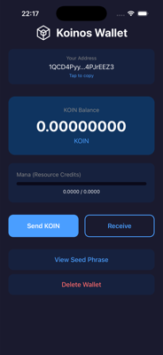

# Koinos Wallet (Expo)

A simple Koinos blockchain wallet built with Expo and React Native. It supports creating/importing wallets, viewing balance/mana, sending KOIN, and receiving via address copy (QR receive is planned).

## Main Screen Overview
The main screen presents a quick summary of your wallet status and key actions:

- **Header and branding**: Displays the Koinos Wallet title with the app logo.
- **Address card**: Shows your wallet address in a shortened format with a “Tap to copy” affordance.
- **Balance card**: Prominently displays your KOIN balance with token label.
- **Mana (Resource Credits)**: Visual progress bar and numeric display for current/max mana.
- **Primary actions**: Large buttons for **Send KOIN** and **Receive**.
- **Security actions**: Quick access to **View Seed Phrase** and **Delete Wallet**.

### Screenshot
<p align="center">
	
</p>

## Prerequisites
- Node.js 18+ (LTS recommended)
- npm 9+ (or yarn/pnpm)
- Xcode (for iOS Simulator and device builds)
- Expo CLI (uses local `npx expo`)
- Apple Developer account (free or paid, for device testing)

## Setup
```bash
cd koinos-wallet
npm install
```

## Run (iOS Simulator)
```bash
# Quick start script
./start-ios.sh

# Or manually
npx expo start --ios
```

## Run (Expo Go on Device)
```bash
npx expo start
```
Then scan the QR code with the Expo Go app on your device.

## Install on Physical iPhone (Development Build)

To run the app directly on your iPhone without the App Store:

### Option 1: Using Expo Go (Easiest)
1. Install **Expo Go** from the App Store on your iPhone
2. Run `npx expo start` on your Mac
3. Scan the QR code with your iPhone camera
4. The app opens in Expo Go

### Option 2: Development Build (Full Native Features)

This creates a standalone app on your iPhone with full native module support.

#### Prerequisites
1. **Apple Developer Account** - Free account works for personal testing
2. **Xcode installed** with command line tools
3. **iPhone connected** via USB cable
4. **Trust your Mac** on the iPhone when prompted

#### Steps

1. **Install EAS CLI** (if not already):
```bash
npm install -g eas-cli
eas login
```

2. **Configure the project** (first time only):
```bash
eas build:configure
```

3. **Create a development build for iOS device**:
```bash
eas build --profile development --platform ios
```

4. **Or build locally** (faster, no cloud):
```bash
npx expo run:ios --device
```
This will:
- Prompt you to select your connected iPhone
- Build the native iOS app
- Install it directly on your device

#### First-time Device Setup
If using a free Apple Developer account:
1. Open **Settings > General > VPN & Device Management** on your iPhone
2. Find your developer certificate and tap **Trust**
3. Relaunch the app

### Option 3: Ad-Hoc Distribution (Share with Testers)

1. **Register test devices** in Apple Developer portal (UDID required)
2. **Build with ad-hoc profile**:
```bash
eas build --profile preview --platform ios
```
3. Share the resulting `.ipa` file or install link with testers

### Debugging on Device
```bash
# View device logs
npx react-native log-ios

# Or use Xcode
# Open ios/*.xcworkspace, select your device, and run
```

## Testing

### Unit Tests (Mocked)
```bash
npm test
```

### Integration Tests (Real Blockchain)
```bash
npm run test:integration
```

## Troubleshooting
- If the simulator shows “No script URL provided”, ensure the Metro bundler is running in this folder and press `i` in the Expo terminal to open the iOS simulator, then `r` to reload.
- If you see Expo SDK compatibility warnings, align versions with:
```bash
npx expo install react-native-get-random-values@~1.11.0 react-native-screens@~4.16.0 react-native-svg@15.12.1
```
